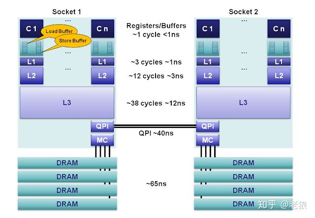
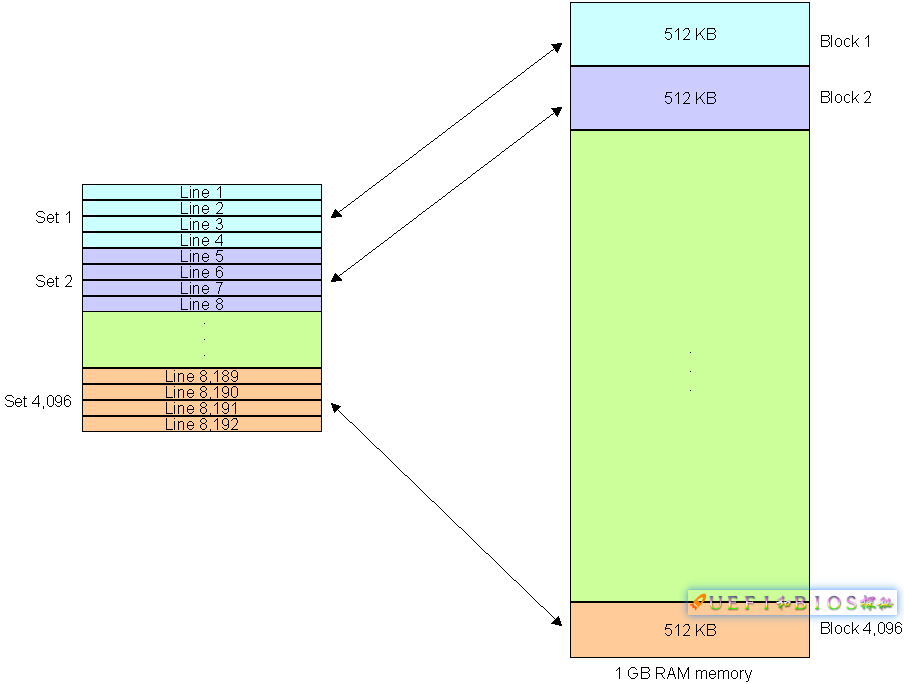
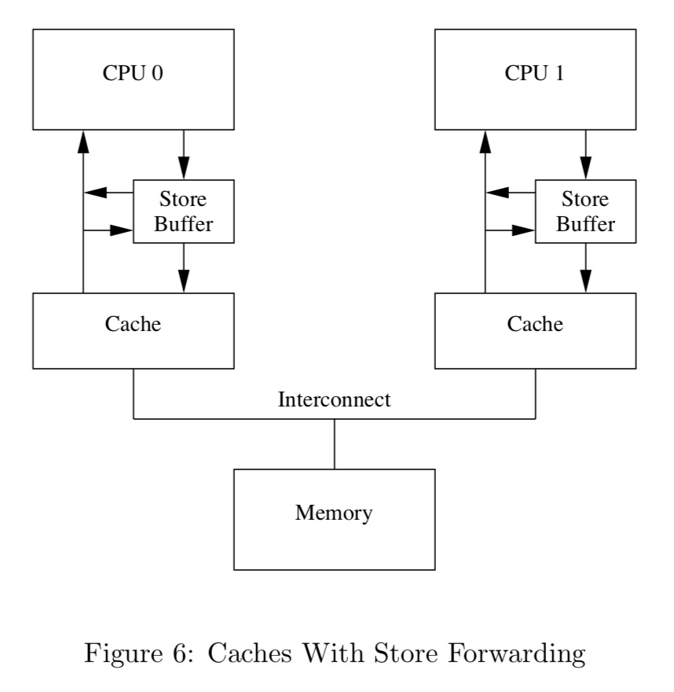
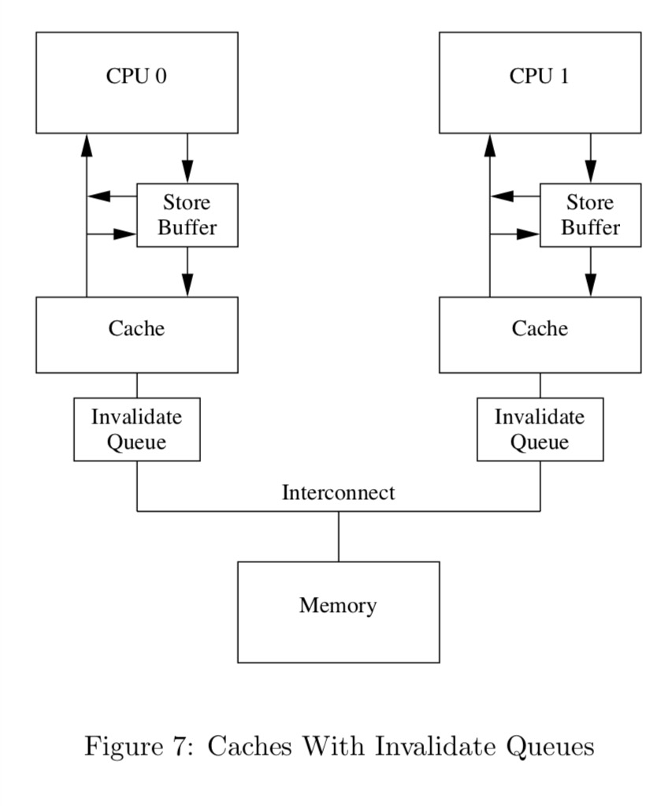

# 从一致性说起

## 简介

   一致性是万恶之源，而软件就是一部提高性能满足一致性的发展史，本文主要想从CPU cache技术发展
    角度浅谈一致性（这里不包含分布式一致性协议）。而我们了解这些技术的目的是为了帮助我们更好的了解这些技术产生的问题，
    适用的范围，如何合理的避免陷阱。
    
    
### CPU cache 

   众说周知，计算机核心组件：CPU、内存、I/O设备， 处理速度CPU的速度 >> 内存 >> I/O设备。
   
   CPU 的处理过程，在 CPU 进行计算时，直接从高速缓存中读取数据并且在计算完成之后写入到缓存中。
   在整个运算过程完成后，再把缓存中的数据同步到主内存。 
   
   

    CPU 结构图
    
+ L1 缓存分成指令缓存与数据缓存。 L2 和 L3 不进行区分。
+ L1 和 L2 缓存为每个核独有， L3所有CPU共享
+ L1 与L2 大小一般为K级别，L3 大小为M级别




计算机核心组件存取速度对比：
+ L1 的存取速度：4 个CPU时钟周期
+ L2 的存取速度： 11 个CPU时钟周期
+ L3 的存取速度：39 个CPU时钟周期
+ 内存的存取速度：107 个CPU时钟周期
   
   
多核CPU处理需要关注两个问题:
+ 缓存命中（应用开发需要关注了解）
+ cache 一致性问题（对应用开发透明），每个CPU都有自己的高速缓存，
   引入缓存的好处是性能大幅提高， 而代价则是需要维护cache的一致性(已经和分布式系统类似)。
   
#### cache 命中

cpu 加载数据时候是按照固定长度的块为单位进行加载，也叫做cache lines。块的大小范围16-256字节。
这里以cache line=64， L1 大小32K为例， 那么L1就有 32KB/64B = 512 个 Cache Line。

CPU 访问情形：
+ cache miss 表示的是CPU第一次访问数据， CPU需要等待上百个时钟周期从内存加载，放到缓存中，后续的访问直接从缓存获取。
+ capacity miss 表示的是当发生访问时候存储的位置已经存在缓存时候，需要先弹出之前的数据进行替换。

cache 数据存储策略:
+ 直接映射(Direct mapped cache)
    
    每个内存块只能映射到一个特定的缓存槽。
    一个简单的方案是通过内存地址映射到对应的槽位(addr % cache_slots)。
    缺点：根据局部原理很容易产生cache的换入换出，产生cache miss。
+ 完全关联(Fully associative cache)

    每个内存块能够被映射到任意一个缓存槽，有点类似哈希表。
    缺点：当需要查找缓存时候需要遍历。
+ N路组关联(N-way set associative cache)

    集合上面两种方案的优点，n路，是指将Cache分成n个组（set），每一组对应一个地址。
    也就是说一个地址可以映射到n个Cache Line中。我们举个4 ways的例子。
    我们先把Cache每4个分成一组,存储时候直接映射有点类似，只是因为按照组划分，
    可以存储的数据变大，减少了cache miss，同时查询时候只需要遍历这个组。



    
应用需要关注的点:
+ cache每次存取是一次性存取cache line大小，在同一个cache line存取速度基本一致。
应用写代码时候尽量把相关的操作数据集中(多线程需要关注false sharing)
这也是为什么很多双层循环优化倾向把逐列遍历改成逐行遍历。
+ 循环内的代码尽量精简，L1 cache 指令缓存有限。

#### cache 一致性

 CPU多核引入cache这个大杀器提升性能，那就要接受另一面，cache之间的更新一致性。
 主流的缓存更新套路主要有两种：
 + Write Through，写操作同时写到cache和内存上
 + Write Back，写操作只要在cache上，然后再flush到内存上
 
 Write Through的优点: 强一致性， 缺点: 性能差
 Write Back则相反， 优点是性能提升， 缺点是弱一致性
 
 目前主流维护一致性是采用Write Back， 为了避免不一致的情况需要MESI协议进行管理。
 
 MESI协议:
 + M=Modified,  缓存行是脏的（dirty），与内存的值不同。如果别的CPU内核要读主存这块数据，该缓存行必须回写到主存，状态变为共享(S). 
 + E=Exclusive, 缓存行只在当前缓存中，与内存值一致。当别的缓存读取它时，状态变为共享；当前写数据时，变为已(M)。
 + S=Shared, 缓存行也存在于其它缓存中且是干净的。缓存行可以在任意时刻抛弃 
 + I=Invalid, 缓存行是无效的

状态转移图
 


通过MESI协议我们可以知道数据存储一旦涉及CPU之间同步比较耗性能:
+ 当读取的cache状态invalid时，需要从其他cpu甚至需要从内存读取数据
+ 设置cache状态为invalid时需要其他CPU的确认

应用需要关注的点:
+ 多线程下需要关注false sharing，假设int a[2]， 多线程环境下CPU 0 不停读取a[0], CPU 1更新a[1]，
由于更新a[1]导致缓存不停的换入换出，而这两个数据在同一个cache line
使得a[0]的读取因为缓存失效导致需要不停从其他CPU或者内存读取

那设置invalid状态一定需要等待其他cpu的确认吗，毕竟其他cpu确认后，也会直接覆盖其他cpu的值
软件行业的真理，增加间接层解决问题。一种方式就是增加store buffer，CPU设置带store buffer
后直接进行下一步工作，store buffer负责通知其他CPU。

 
软件行业的另外一个真理，引入间接层解决问题，我们也引入一个新问题。
看一个例子:
```c
void foo(){
	a = 1;
	b = 1;
}

void bar(){
	while (b == 0) continue;
	assert(a == 1);
}
```

假设CPU 0 执行foo CPU1 执行bar， a 存储在CPU1的cache，b存储在CPU0
1. CPU 0 执行 a = 1, cache miss，CPU0 设置a=1 到store buffer，发送invalid消息

2. CPU1执行while (b == 0) continue; b也发生cache miss，，CPU1发出读取b消息

3. CPU0 执行b=1，b已经在cache，直接存储b=1到cache

4. CPU0收到读取b的请求，发送cache中b的值到CPU1，同时状态转成shared

5. CPU1 收到b=1，跳过continue

6. CPU 执行assert(a == 1), assert 失败

7. CPU1收到invalid 消息，发送a的值CPU0，CPU1的cache状态转成invalid

通过上面例子我们知道无法完全预测CPU的行为，因为硬件工程师无法知道哪些变量是有依赖的
所以硬件工程师提供了memory-barrier机制，使得软件工程师可以通知CPU他们的依赖关系。

#### memory-barrier

```c
void foo(){
	a = 1;
	smp_mb();
	b = 1;
}

void bar(){
	while (b == 0) continue;
	assert(a == 1);
}
```

这里相比前面的代码增加了smp_mb(); 
我们重新看下他们的运行
假设CPU 0 执行foo CPU1 执行bar， a 存储在CPU1的cache，b存储在CPU0

1. CPU 0 执行 a = 1, cache miss，CPU0 设置a=1 到store buffer，发送invalid消息

2. CPU1执行while (b == 0) continue; b也发生cache miss，，CPU1发出读取b消息

3. CPU0 执行smp_mb， 标记当前所有的store buffer(a=1)

4. CPU 0 执行b =1，存储在store buffer，cache line b不变

5. CPU 0 收到读请求，发送b = 0给CPU 1， 状态转成shared

6. CPU 1 收到b = 0，存储到cache， while (b == 0) continue

7. CPU 1 收到read invalid消息，发送a的值 CPU 0，并且把状态转成invalid 

8. CPU 0 收到a消息，发送b invalid消息 CPU 1 

9. CPU 1收到invalid 消息， invalid b 缓存，发送acknowledgement 消息给CPU 0

10. CPU1执行while (b == 0) continue; b也发生cache miss，，CPU1发出读取b消息

11. CPU 0 收到acknowledgement 消息，存储b=1到cache line

12. CPU 0 收到读取b消息，发送b=1 消息 CPU 1，状态转换为shared

13. CPU 1收到b=1消息，放到cache，执行while (b == 0) 跳过 执行assert(a == 1)
缓存为空， 重新从CPU 0读取a的值 a = 1

从上面执行看我们可以得知，当有smp_mb CPU会把数据存储在store buffer来避免其他CPU读取错误值
但是store buffer很小，以上面例子说明，假设CPU 的store只能存储一份数据，执行a=1后存储到store
，执行b =1 无法进行，需要等待CPU 1接受到a 失效的确认才能进行下一步，这里问题在于把所有数据都存储
在store buffer。因此硬件工程师引入invalidate queue进行分离。

 

引入invalidate queue后发送invalid消息后可以在放到队列后马上收到确认，不需要等待其他CPU的响应
但是同时产生新问题。以上面例子说明执行:
1. CPU 0 执行 a = 1, cache miss，CPU0 设置a=1 到store buffer，发送invalid消息

2. CPU1执行while (b == 0) continue; b也发生cache miss，，CPU1发出读取b消息

3. CPU 0 执行b =1，存储在cache line

4. CPU 0  收到读取b 消息， 发送b=1，更新状态为shared

5. CPU 1 收到a 失效消息，添加a 到失效队列，回复a acknowledgement失效消息，（这时老的a值还是在缓存）

6. CPU 1收到b=1，执行while (b == 0)， 跳过

7. CPU 1执行assert(a==1)， 失败，CPU 1处理失效队列中的消息，设置缓存失效

解决方案也很简单

```c
void foo(){
	a = 1;
	smp_mb();
	b = 1;
}

void bar(){
	while (b == 0) continue;
	smp_mb();
	assert(a == 1);
}
```

执行 smp_mb()后续的load操作都需要等待所有标记的entry 都应用到CPU cache。

执行过程:
1. CPU 0 执行 a = 1, cache miss，CPU0 设置a=1 到store buffer，发送invalid消息

2. CPU1执行while (b == 0) continue; b也发生cache miss，，CPU1发出读取b消息

3. CPU 0 执行b =1，存储在cache line

4. CPU 0  收到读取b 消息， 发送b=1，更新状态为shared

5. CPU 1 收到a 失效消息，添加a 到失效队列，回复a acknowledgement失效消息，（这时老的a值还是在缓存）

6. CPU 1收到b=1，执行while (b == 0)， 跳过

7. CPU 1 执行smp_mb()， 标记失效队列

8. CPU 1执行assert(a==1), 这是一个load操作，等待失效队列应用

9. CPU 1处理失效队列中的消息，设置缓存失效，CPU 1发出读取a消息

10. CPU 0 收到acknowledge消息更新，更新缓存a = 1

11. CPU 0 收到读取a消息，发送a=1

在上面的例子中，用了smp_mb() 作为memory-barrier，实际上CPU 0只需要写屏障，CPU1 只需要读屏障

```c
void foo(){
	a = 1;
	smp_wmb();
	b = 1;
}

void bar(){
	while (b == 0) continue;
	smp_rmb();
	assert(a == 1);
}
```

通过上面的例子我们已经知道memory-barrier是什么,和他的作用。

memory-barrier主要包含四种:
+ 写屏障(Write (or store) memory barriers)
    
    smp_wmb写屏障主要指导的是写屏障前面的store指令都需要在屏障后面的先执行
    
+ 读屏障(Read (or load) memory barriers)

    smp_rmb读屏障主要指导的是读屏障后面的load操作都需要先执行invalid queue中的指令，
    读屏障前面的load操作也必须在屏障后面的load之前进行
    
+ 通用屏障(General memory barriers)

    smp_mb通用屏障是写屏障和读屏障的集合
    
+ 数据依赖屏障(Data dependency barriers)

    smp read barrier depends数据依赖屏障是读屏障的弱化版，
    假设有两个LOAD操作的场景, 其中第二个LOAD操作的结果依赖于第一个操作
    (比如, 第一个LOAD获取地址, 而第二个LOAD使用该地址去取数据), 
    数据依赖屏障确保在第一个LOAD获取的地址被用于访问之前, 第二个LOAD的目标内存已经更新.
    
    


    
## 参考资料:

http://www.puppetmastertrading.com/images/hwViewForSwHackers.pdf

https://www.kernel.org/doc/Documentation/memory-barriers.txt

https://yarchive.net/comp/linux/store_buffer.html

https://lp007819.wordpress.com/2013/12/31/linux%E5%86%85%E6%A0%B8%E5%86%85%E5%AD%98%E5%B1%8F%E9%9A%9C/

http://ifeve.com/linux-memory-barriers/
