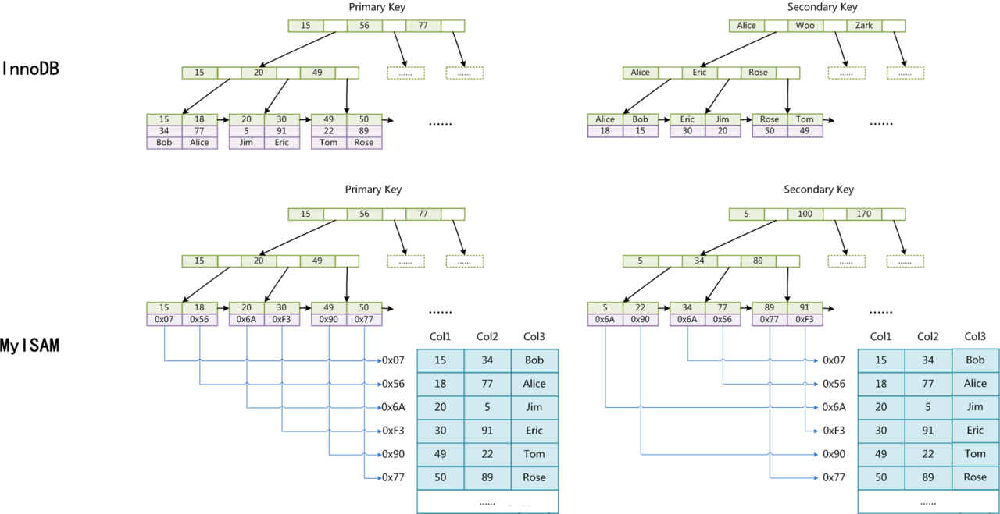

# mysql 总结

## 简介

以下默认innodb引擎， 事务级别为RC或者RR 的一些总结。

mysql在应用层面需要关注的点:
+ 锁机制
+ 索引机制

## mysql 索引

mysql 主要有两种索引，聚簇索引（Clustered Index）与 非聚簇索引(Secondary Index)。

聚簇索引行会包含所有数据，位于B+数叶子节点。

每一个非聚簇索引行都会包含primary key，方便回扫聚簇索引行。

 

### mysql 索引扫描原则

索引扫描原则就是B+树的特点决定，联合索引需要按照索引位置进行匹配。

## mysql 锁

+ 行锁
+ 共享锁（允许事务在读时候hold锁）
+ 间隙锁（RR 级别下为了避免幻读，需要锁住前后gap）
+ 排他锁（允许事务在更新和删除hold锁）
+ 表锁
+ 意向锁 （为了解决锁表需要查询行锁效率问题产生的锁，不与行锁冲突）
+ next key锁（行锁+gap锁）

## mysql 锁机制

RC事务级别与RR级别最大的区别是不需要gap锁，一般在普通index时候进行当前读会产生，
primary key与unique key查询一致。

锁范围根据where提取的index key决定

## mysql mvcc

mysql mvcc多版本控制在readview 时候RC与RR的区别在于 RC是语句级别的readview，RR是事务级别

## mysql 事务总结

RC vs RR:
+ RC
> + 优势:
>> + 高并发，低锁开销，semi-consistent read
>> + 没有gap锁，释放锁比较快

> + 劣势:
>> + 语句级快照，每条语句都需要新建readview，存在幻读

+ RR
> + 优势:
>> + 与RC相反

> + 劣势:
>> + 与RC相反
