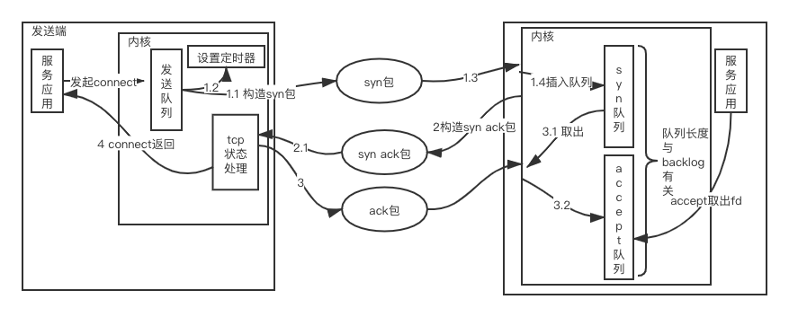
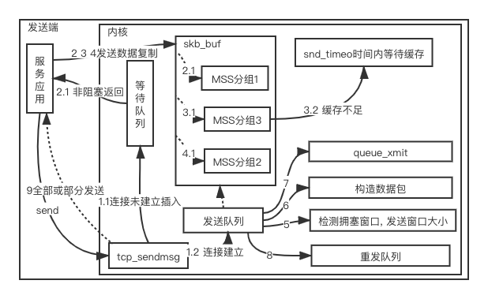
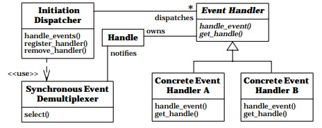
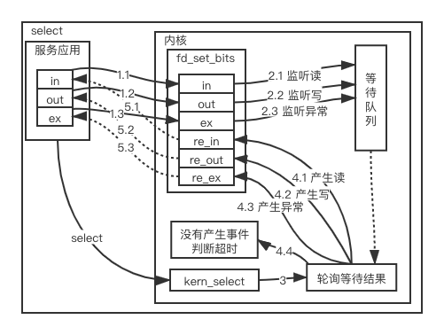

# 从TCP说起

## TCP 协议简介

TCP 全称Transmission Control Protocol， RFC793详细的说明TCP协议设计的目的和细节。
TCP 协议的目的是提供一个可靠，高可用的端到端协议。

## TCP 设计

我们先考虑下假如我们需要设计一个可靠，高可用的端到端协议，而网络不可靠，底层协议不可靠
我们会面对哪些问题:

+ 如何确保对端可靠收到消息 
    - 对端确认消息机制（对端支持消息确认，才能做到推送可靠）
    - 发送端重发机制 （对端没有收到需要重传）
    - 重传过滤 （网络不可靠，假如对端收到消息，发送端没有收到确认发起重传，对端需要识别）
   
+ 如何建立可靠连接
    - 五元组+序列号标示（序列号尽量保证唯一）
    - 对端确认连接机制
                                     
+ 如何正常断开连接
    - 对端消息确认机制
    
### 对端确认消息机制

最简单的做法每次收到数据包回复一个收到(ack)
### 发送端重发机制

+ 消息太大如何发送
    - 消息分片
+ 如何识别需要重发的消息（消息片）
    - 设置一个超时时间，超过超时时间还没收到ack，发起消息重发
    - ack携带分片信息

### 重传过滤

最简单做法，服务端收到数据包后发现不连续先缓存起来，等待发送端重传，记录所有分片信息，发现重传了已经收到的消息直接过滤

### 如何建立可靠连接

序列号需要满足两个特点:
+ 单调递增（识别数据包，支持重发过滤机制）
+ 安全难以模拟

序列号如何生成
+ 固定数字 缺点：不满足安全（可以构造tcp的数据包），
    连接可能发生串包（发送数据包网络延迟，连接断开重新连接，延迟数据包到达）
+ 时间戳 缺点： 不满足安全（可以猜时间戳）
+ 随机数 缺点：不满足单调递增 
+ 时间戳+无法猜测的数

对端确认连接机制:
+ 对端收到连接请求后回复ack，确认连接建立（缺点：底层网络不可靠，无法识别老连接，服务端信息不足）
+ 对端收到连接请求后回复ack，发送端确认连接建立，通知对端

### 如何断开

TCP是一个端到端全双工协议，客户端与服务端建立连接后是各自独立，两边都可以发起断开请求，存在以下场景:
+ 发送端发起断开，服务端收到后被动应答，断开
+ 服务端发起断开，发送端被动应答断开
+ 双方主动发起断开连接

假如是我们设计可靠的端到端协议，以上大概是能想到的场景和解决方案。上面的设计还缺少很多方面考虑（安全，性能，流控...）

接下来我们看下RFC 是怎么规范TCP协议的

## RFC与TCP

 

TCP 头设计

### 如何建立可靠连接

#### ISN 生成

RFC793 说明了ISN的生成 The generator is bound to a (possibly fictitious) 32 bit clock 
whose low order bit is incremented roughly every 4
microseconds.  Thus, the ISN cycles approximately every 4.55 hours.

ISN会和一个假的时钟绑在一起，这个时钟会在每4微秒对ISN做加一操作，直到超过2^32，又从0开始。
这样，一个ISN的周期大约是4.55个小时。我们假设我们的TCP Segment在网络上的存活时间不会超过MSL

更进一步RFC1948 设计了新的算法
ISN = M + F (Sip, Sport, Dip, Dport, <Some Secret>)

F：单向散列哈希函数
<Some Secret>：哈希函数可选部分，使远程攻击者更难猜到ISN。
其他不解释了

#### RFC793 建立连接

 

RFC793说明了为什么需要3次握手 The principle reason for the three-way handshake is to prevent old
 duplicate connection initiations from causing confusion. 

3次握手主要目的就是协商ISN，通信的双方要互相通知对方自己的初始化的Sequence Number，这样可以保证
在网络乱序情况下协议可以通过这个SN，还原发送端的数据包。假如两次的话服务端无法区分老的连接（信息不足）

#### RFC 7413 建立连接

 

3次握手性能一般（特别是在弱网环境下），Google研究发现TCP三次握手是页面延迟时间的重要组成部分，所以他们提出了
TFO：在TCP握手期间交换数据，这样可以减少一次RTT。

### 发送端重发机制

#### RFC 793重传机制

发送端需要维护最大连续确认ack，比如，发送端发了1,2,3,4,5一共五份数据，接收端收到了1，2，于是回ack 3，然后收到了4（注意此时3没收到）
超过一定时间后发送端只知道目前对端收到的最大包为3， 可以选择两种重传:
+ 仅重传timeout的包。也就是第3份数据。（优点：节省带宽，缺点：可能需要多次重传）
+ 重传timeout后所有的数据，也就是第3，4，5这三份数据。（优缺点与上面相反）

#### RFC 2581 重传机制（Fast Retransmit）

 

2581 引入快速重传机制，包没有连续到达，就ack最后那个可能被丢了的包，如果发送方连续收到3次相同的ack，就重传。避免了等到超时在重传。
Fast Retransmit 解决了超时等待问题，但是无法解决到底传输什么包问题。

#### RFC 2018  重传机制（Selective Acknowledgment）

 

2018 利用了tcp协议option，加入了一个SACK的东西，保存收到的不连续数据碎版。在发送端就可以根据回传的SACK
就知道需要重传哪些数据。（内核的之前的实现有坑，爆出过漏洞 CVE-2019-11477 SACK Panic）

### 流控机制

#### 滑动窗口 （Sliding Window）

滑动窗口的意义在于避免服务端拥塞，与sack类似，服务端通知发送端还能发送的数据窗口大小。使得发送端可以动态
调整发送的数据大小。

 

接收方还可以处理的数据量：

AdvertisedWindow = MaxRcvBuffer-(LastByteRcvd-LastByteRead)

窗口内剩余可发送的数据大小：

EffectiveWindow = AdvertisedWindow -(LastByteSent-LastByteAcked)

一旦服务端窗口大小为0， 发送端通过Zero Window Probe探测服务端窗口大小，多次是0可能会RST连接

### 拥塞控制

流控机制解决的是端到端之间的拥塞，tcp居然还考虑整个网络的拥塞情况，拥塞处理的流程主要是:
+ 爬升期(slow start)
+ 稳定期(congestion avoidance):   
+ 下降期(congestion control)
+ 恢复期(fast recover)

考虑网络的拥塞情况主要基于以下方式:
+ 基于丢包
    - Reno
    
    适用场景: 低带宽，低延时(假如rtt很大导致拥塞窗口增长很慢，带宽利用率低)
    - Cubic
    
    适用场景: 高带宽、低丢包率网络，能够有效利用带宽
    - BIC
    
总的来说基于丢包的拥塞算法无法处理Buffer bloat，对延时算法不公平
+ 基于时延
    - Vegas
    
    无法处理bufferbloat，公平性不够，vegas根据rtt判断拥塞退让很可能被其他协议占用带宽。
    - Fast TCP
+ 基于链路容量
    - BBR
    
    适用场景: 高带宽、高时延、有一定丢包率的长肥网络，可以有效降低传输时延，并保证较高的吞吐量
    - Westwood
+ 基于学习
    - JetMax

更多算法可以参考下面参考资料TCP_congestion_control链接， 拥塞控制应该是tcp最复杂部分，
需要根据场景选择不同的算法。

## 现实中的tcp

### tcp性能问题

#### delay ack与Nagle同时开启

Nagle 与delay ack解决的问题是一致的，只是一个针对发送端，一个针对服务端。但是一旦一起用就很可能出现性能问题。

场景: client要发送一个http请求给server，这个请求有1600个bytes，握手的MSS是1460，那么这1600个bytes就会分成2个TCP包，
第一个包1460，剩下的140bytes放在第二个包。第一个包发出去后，server收到第一个包，因为delay ack所以没有回复ack，
同时因为server没有收全这个HTTP请求，所以也没法回复HTTP response。
client这边开启了Nagle算法（默认开启）第二个包比较小（140<MSS),第一个包的ack还没有回来，那么第二个包就不发了，
等！互相等！一直到Delay Ack的Delay时间到了

#### tcp全连接队列溢出

服务端建立连接分为半连接队列（收到syn包 回复了syn ack）， 与全连接队列（收到发送端ack包， 从半连接队列转移到全连接队列）
假如服务端全队列满了，会忽略发送端发过来的ack包，而发送端误认为连接已经建立，发送data后无法接到ack，进入重传最后发起断开。

### tcp安全问题

tcp的设计非常复杂，复杂意味着熵很大，意味着可能有很多漏洞，下面简单介绍几种攻击。
#### syn洪水攻击

发送端发送伪造的syn请求后忽略服务方推送的syn ack，服务端保持在半连接队列，等待超时重传。
这些syn请求将长时间占用半连接队列，消耗服务方资源，大量的发送端同时进行类似请求就造成ddos攻击。

#### RST复位攻击

RST 主要的作用是关闭异常连接，发送端发送RST不等缓冲区的数据直接发送。

场景1： A和B建立连接， A发送数据，等待B的响应，A放弃连接（进程重启），B的响应到达，A发送RST，B收到connect reset by peer

A和服务器B之间建立了TCP连接，C伪造A发过去的RST包，B就会放弃与A的缓冲区上所有数据，强制关掉连接。

C伪造A 发起syn请求，B主动发RST请求，强制关闭A的连接

伪造A的包 难点在构造seq和获取source port。
### tcp 内核

#### connect和accept



应用发起connect可以选择non-block或者block，选择非阻塞的话发送syn后
会返回EINPROGRESS错误标示连接正在进行，需要用select epoll等待可写。

connect 需要处理的错误
+ 连接中的错误
    - EINPROGRESS Operation now in progress
    - EINTR 系统调用的执行由于捕获中断而中止
    - EISCONN Transport endpoint is already connected
    
应用端处理 用epoll，select等待可写事件
+ 重试错误
    - EAGAIN Resource temporarily unavailable
    - EADDRINUSE 地址被占用
    - EADDRNOTAVAIL 端口非正常
    - ECONNREFUSED 远程地址并没有处于监听状态
    - ENETUNREACH 不可达
应用端可以关闭当前连接，等待重试

+ 无法恢复错误
   
应用直接关闭连接     
    
同理服务端accept也可以采用非阻塞模式，也需要用select epoll等待可读

accept 需要处理的错误:
+ 并发数过多错误
    - EMFILE 

服务端可以利用一个idle连接，当发生EMFILE错误释放idle连接，然后accept一个fd，在释放这个fd通知发送端，重新复用idle连接

#### send



应用发起send，当处于非阻塞模式下，连接没有建立的话直接返回EAGAIN。应用通过select epoll继续监听连接变化。
在非阻塞模式下，应用需要注意写入数据长度问题，当没有全部发送成功，需要根据select epoll监听可写写入剩下数据。

应用还需要了解send成功不代表数据已经到达服务端，只是代表内核尽力发送。这也是为什么End to End Argument反复
强调端到端的可靠通信，只能通过通信两端的application层来保证。
#### recv

#### close

### tcp 框架
+ reactor模型
+ proactor模型

#### reactor



Reactor模式是基于事件驱动的设计模式,逆置了事件处理流程，从应用程序主动调用某个API处理到注册感兴趣的event，
当event发生时候回调应用程序注册接口。（IOC的应用）

Reactor模型主要3个组件组成:
+ Reactor Dispatcher
+ Demultiplexer (select epoll io复用组件封装)
+ Event 针对Handle IO事件封装（Handle 在这里主要是fd）

Reactor Dispatcher组件是reactor模型的核心，负责整个模型的启动和驱动。
Event注册感兴趣的事件到Dispatcher，Dispatcher通过Demultiplexer进行事件分离通知。

#### Multi-Reactor 模型


Multi-Reactor 相比Reactor 主要的优化是基于tcp的特点分离出IO操作线程与工作线程。优点是当应用程序慢时候不影响IO事件
（具体原因可参考accept的分析）

#### select 实现




select 优缺点:

优点 实现简单，fd比较少 很活跃的情况下效率很高

缺点 支持的fd数量有限，fd数量越大，扫描效率越低

适用场景 监听的fd比较少，fd活跃

#### epoll 实现

epoll的核心是红黑树管理需要监听的fd和相关event，同时采用就绪队列规避select的缺点，
直接访问就绪队列就知道event信息。

```c
struct eventpoll {
	/* Wait queue used by sys_epoll_wait() */
	wait_queue_head_t wq; // 调用epollwait的等待队列

	/* Wait queue used by file->poll() */
	wait_queue_head_t poll_wait; // 调用poll的等待队列

	/* List of ready file descriptors */
	struct list_head rdllist; // 就绪队列

	/* RB tree root used to store monitored fd structs */
	struct rb_root_cached rbr; // fd管理器

	/*
	 * This is a single linked list that chains all the "struct epitem" that
	 * happened while transferring ready events to userspace w/out
	 * holding ->lock.
	 */
	struct epitem *ovflist; // 备选就绪队列

	/* wakeup_source used when ep_scan_ready_list is running */
	struct wakeup_source *ws;
	
	...
};

```

红黑树不好画直接描述步骤，省略很多细节（比如锁， 参数校验）

epoll_ctl 支持3种状态EPOLL_CTL_ADD（最复杂），EPOLL_CTL_MOD，EPOLL_CTL_DEL

epoll_ctl_EPOLL_CTL_ADD:
+ 初始化epitem
+ 设置poll_wait回调函数
+ poll等待回调
+ 插入红黑树
+ 产生事件，唤醒wq等待队列

epoll_wait:
+ 计算睡眠超时时间
+ 查询是否有准备好事件（查看就绪队列和备选就绪队列是否为空）
    - 有准备好事件执行 send_events
    - 没有准备好事件执行 fetch_events
+ fetch_events
    - 设置当前进程为可中断睡眠状态
    - 查询是否有准备好事件（没有直接睡眠，等待唤醒， 有直接唤醒进程 执行send）
+ send_events
    - 拷贝事件信息到应用层（假如是LT模式，重新加入就绪队列）

#### io_uring


### 参考资料:

https://tools.ietf.org/html/rfc793

https://tools.ietf.org/html/rfc2581

https://tools.ietf.org/html/rfc7413

http://static.googleusercontent.com/media/research.google.com/zh-CN/us/pubs/archive/37517.pdf

https://en.wikipedia.org/wiki/TCP_congestion_control

http://jm.taobao.org/2017/06/01/20170601/

https://web.mit.edu/Saltzer/www/publications/endtoend/endtoend.pdf

http://www.laputan.org/pub/sag/reactor.pdf